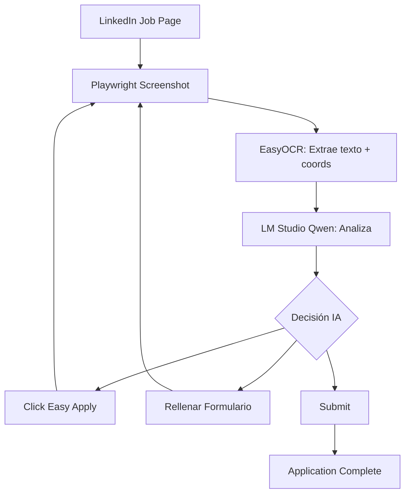

# 🚀 AI JOB FOUNDRY - PROMPT MIGRACIÓN CHAT (75% → 85%)

**Fecha:** 2026-01-27 14:50 CST  
**Chat anterior:** 75% completado  
**Próximo objetivo:** Auto-Apply con IA LOCAL (100% gratis, sin APIs pagas)

---

## 📊 ESTADO ACTUAL DEL PROYECTO

### ✅ **FUNCIONANDO (70-75%):**

1. **OAuth & Gmail** - 100%
   - Auto-refresh cuando expira
   - Procesa boletines de LinkedIn/Indeed/Glassdoor
   - 751 emails procesados

2. **AI Analysis** - 100%
   - Script: `scripts/maintenance/calculate_linkedin_fit_scores.py`
   - Usa LM Studio local (Qwen 2.5 14B)
   - 147 FIT scores calculados (7-8/10 promedio)
   - 2 errores por rate limit de Google Sheets

3. **LinkedIn Auto-Login** - 100%
   - Credenciales del .env
   - Guarda sesión en `linkedin_session.json`
   - Auto-reautentica si expira

4. **DRY RUN Mode** - 100%
   - Procesa 10 jobs con FIT 7+
   - NO actualiza Sheets (solo prueba)
   - Funciona perfectamente

### ⚠️ **FUNCIONANDO A MEDIAS (5%):**

5. **LIVE Auto-Apply** - 50%
   - ✅ Abre páginas de LinkedIn
   - ✅ Mantiene sesión activa
   - ❌ NO hace clic en "Easy Apply"
   - ❌ NO rellena formularios
   - ❌ Timeout después de 5 minutos

**Razón del fallo:**
- El código actual busca `button:has-text("Easy Apply")` pero probablemente:
  - El botón tiene texto diferente (idioma, variantes)
  - Está dentro de un iframe/shadow DOM
  - Requiere scroll para ser visible
  - LinkedIn detecta automatización y cambia estructura

### ❌ **PENDIENTE (20%):**

6. **Auto-Apply con IA LOCAL (100% GRATIS)** - 0%
   - Nuevo archivo: `auto_apply_linkedin_ai_local.py`
   - **Screenshot → EasyOCR (gratis) → Extrae texto + coordenadas**
   - **LM Studio Qwen 2.5 14B → Analiza texto y decide acciones**
   - **Playwright Smart Locators → Fallback sin OCR**
   - Formularios adaptativos con IA local
   - Multi-step form handling
   - Preguntas de screening con LM Studio

7. **Interview Copilot** - 0%
   - Ayuda con prep de entrevistas
   - Inyecta contexto del job

8. **Dashboard Web** - 0%
   - Visualización de progreso

---

## 🗂️ ESTRUCTURA DEL PROYECTO

```
C:\Users\MSI\Desktop\ai-job-foundry\
├── core/
│   ├── automation/
│   │   ├── auto_apply_linkedin.py              ← VIEJO (mantener)
│   │   ├── auto_apply_linkedin_ai_local.py     ← NUEVO (crear)
│   │   ├── linkedin_ocr_helper.py              ← Helper para OCR
│   │   ├── gmail_jobs_monitor.py
│   │   └── job_bulletin_processor.py
│   ├── enrichment/
│   │   └── ai_analyzer.py
│   ├── ingestion/
│   │   ├── linkedin_scraper_V2.py
│   │   └── indeed_scraper.py (timeout issues)
│   └── sheets/
│       └── sheet_manager.py
├── scripts/
│   ├── maintenance/
│   │   ├── calculate_linkedin_fit_scores.py    ← FUNCIONA 100%
│   │   └── recalculate_fit_scores.py           ← USA TAB "Jobs" (incorrecto)
│   ├── oauth/
│   │   ├── regenerate_oauth_token.py
│   │   └── reauthenticate_gmail_v2.py
│   └── verifiers/
│       └── LINKEDIN_SMART_VERIFIER_V3.py
├── data/
│   └── credentials/
│       ├── token.json
│       ├── credentials.json
│       └── linkedin_session.json               ← Auto-generado
├── .env                                        ← CREDENCIALES
├── control_center.py                           ← MENU PRINCIPAL
└── run_daily_pipeline.py

```

---

## 🔧 ARCHIVOS CRÍTICOS

### **1. control_center.py**
- Menu principal del sistema
- Opción 11: DRY RUN (funciona)
- Opción 12: LIVE (timeout)
- Acepta confirmación: S, SI, SÍ, YES, Y

### **2. calculate_linkedin_fit_scores.py**
```python
# IMPORTANTE: Usa estos métodos de SheetManager
jobs = sheet_manager.get_all_jobs('linkedin')  # NO read_tab()
sheet_manager.update_job(row, updates, 'linkedin')

# Agrega row numbers
for i, job in enumerate(jobs, start=2):
    job['_row'] = i
```

### **3. auto_apply_linkedin.py (VIEJO)**
```python
# Línea 81-87: Get jobs + add row numbers
linkedin_jobs = self.sheet_manager.get_all_jobs(tab='linkedin')
for i, job in enumerate(linkedin_jobs, start=2):
    job['_row'] = i

# Línea 218-270: Auto-login con credenciales
linkedin_email = os.getenv('LINKEDIN_EMAIL')
linkedin_password = os.getenv('LINKEDIN_PASSWORD')

# Línea 285-287: Actualiza Sheets solo en LIVE
if not self.dry_run:
    await self.update_job_status(job, applied=success)
```

### **4. SheetManager métodos**
```python
# Leer tab
jobs = sheet_manager.get_all_jobs('linkedin')  # minúscula
# NO usar: read_tab() - no existe

# Actualizar job
sheet_manager.update_job(row, updates, 'linkedin')
# row = número de fila (2 = primera oferta)
# updates = {'Status': 'Applied', 'NextAction': 'Auto-applied...'}
```

---

## 🔑 CREDENCIALES Y CONFIGURACIÓN

### **.env (CRITICAL):**
```env
# LinkedIn
LINKEDIN_EMAIL=markalvati@gmail.com
LINKEDIN_PASSWORD=4&nxXdJbaL["Rax*C!8e"4P5

# LM Studio (LOCAL - GRATIS)
LLM_URL=http://127.0.0.1:11434/v1/chat/completions
LLM_MODEL=qwen2.5-14b-instruct

# Google Sheets
GOOGLE_SHEETS_ID=1EqWPiHdcYyMr5trEuiT_-lzPVEr0owOoDEetTsCIBxdg

# OAuth
GOOGLE_CREDENTIALS_PATH=data/credentials/credentials.json
GOOGLE_TOKEN_PATH=data/credentials/token.json
```

### **Google Sheets URL (CORRECTO):**
```
https://docs.google.com/spreadsheets/d/1EqWPiHdcYyMr5trEuiT_-lzPVEr0owOoDEetTsCIBxdg/edit#gid=0
```

**TABS:**
- Registry (general)
- **LinkedIn** ← USAR ESTE (159 jobs)
- Indeed (5 jobs)
- Glassdoor (452 jobs)

---

## 🎯 PRÓXIMO OBJETIVO: AUTO-APPLY CON IA LOCAL (100% GRATIS)

### **STACK TECNOLÓGICO - TODO GRATIS:**

1. **EasyOCR** - Python package gratis para OCR
   - Extrae texto de screenshots
   - Detecta coordenadas de cada elemento
   - Multilenguaje (inglés + español)
   - `pip install easyocr`

2. **LM Studio Qwen 2.5 14B** - Ya instalado
   - Analiza texto extraído por OCR
   - Decide qué botón clickear
   - Genera respuestas para formularios
   - 100% local, sin costos

3. **Playwright Smart Locators** - Gratis, built-in
   - `getByRole('button', {name: /apply/i})`
   - `getByLabel('First Name')`
   - Fallback cuando OCR falla

### **ARQUITECTURA PROPUESTA (100% LOCAL):**

```python
# auto_apply_linkedin_ai_local.py

import easyocr
import requests
from playwright.async_api import async_playwright

class LinkedInAutoApplierLocal:
    """
    Auto-apply usando IA LOCAL (LM Studio) + OCR GRATIS (EasyOCR)
    NO requiere APIs pagas
    """
    
    def __init__(self):
        # EasyOCR reader (inglés + español)
        self.ocr_reader = easyocr.Reader(['en', 'es'], gpu=True)
        
        # LM Studio local
        self.llm_url = "http://127.0.0.1:11434/v1/chat/completions"
        self.llm_model = "qwen2.5-14b-instruct"
        
        # CV data
        self.cv_data = CV_DATA
    
    async def analyze_page_with_ocr(self, screenshot_path):
        """
        1. OCR extrae texto + coordenadas
        2. LM Studio analiza y decide acciones
        
        Returns: {
            "action": "click_easy_apply" | "fill_form" | "submit",
            "target": {"text": "Easy Apply", "coords": [100, 200]},
            "fields": [...]
        }
        """
        # 1. OCR extraction
        ocr_results = self.ocr_reader.readtext(screenshot_path)
        
        # 2. Prepare text for LM Studio
        text_elements = []
        for (bbox, text, confidence) in ocr_results:
            if confidence > 0.5:  # Filter low confidence
                x, y = int(bbox[0][0]), int(bbox[0][1])
                text_elements.append({
                    "text": text,
                    "x": x,
                    "y": y,
                    "confidence": confidence
                })
        
        # 3. Ask LM Studio what to do
        prompt = f"""You are analyzing a LinkedIn job application page.
        
        Text elements detected (with coordinates):
        {json.dumps(text_elements, indent=2)}
        
        Candidate info:
        {json.dumps(self.cv_data, indent=2)}
        
        Respond in JSON format:
        {{
            "action": "click_button" | "fill_form" | "submit" | "next_page",
            "reasoning": "why you chose this action",
            "target": {{
                "text": "Easy Apply",
                "coords": [x, y]
            }},
            "fields_to_fill": [
                {{"label": "First Name", "value": "Marcos", "coords": [x, y]}}
            ]
        }}
        
        Priority: Look for "Easy Apply", "Solicitar empleo fácil", "Apply" buttons first.
        """
        
        response = requests.post(
            self.llm_url,
            json={
                "model": self.llm_model,
                "messages": [{"role": "user", "content": prompt}],
                "temperature": 0.3,
                "max_tokens": 1000
            },
            timeout=30
        )
        
        ai_decision = response.json()['choices'][0]['message']['content']
        
        # Parse JSON from LM Studio
        import json
        ai_decision = ai_decision.replace('```json', '').replace('```', '').strip()
        return json.loads(ai_decision)
    
    async def apply_to_job_with_local_ai(self, job, page):
        """
        Main workflow with LOCAL AI + OCR
        """
        url = job['ApplyURL']
        
        # 1. Navigate
        await page.goto(url, wait_until='domcontentloaded')
        await asyncio.sleep(2)
        
        max_steps = 10
        for step in range(max_steps):
            # 2. Take screenshot
            screenshot_path = f"temp_screenshot_{step}.png"
            await page.screenshot(path=screenshot_path)
            
            # 3. Analyze with OCR + LM Studio
            ai_decision = await self.analyze_page_with_ocr(screenshot_path)
            
            print(f"   🤖 AI Decision: {ai_decision['action']}")
            print(f"   💭 Reasoning: {ai_decision['reasoning']}")
            
            # 4. Execute action
            if ai_decision['action'] == 'click_button':
                target = ai_decision['target']
                
                # Try Playwright locator first (more reliable)
                try:
                    button = page.get_by_role('button', name=re.compile(target['text'], re.I))
                    if await button.is_visible():
                        await button.click()
                        print(f"   ✅ Clicked: {target['text']}")
                    else:
                        # Fallback to coordinates
                        await page.mouse.click(target['coords'][0], target['coords'][1])
                        print(f"   ✅ Clicked at: {target['coords']}")
                except:
                    # Fallback to OCR coordinates
                    await page.mouse.click(target['coords'][0], target['coords'][1])
                    print(f"   ✅ Clicked at: {target['coords']}")
                
                await asyncio.sleep(2)
                
            elif ai_decision['action'] == 'fill_form':
                for field in ai_decision['fields_to_fill']:
                    await self.fill_form_field(page, field)
                
            elif ai_decision['action'] == 'submit':
                print("   ✅ Application complete!")
                return True
                
            elif ai_decision['action'] == 'next_page':
                # Click next button
                next_btn = ai_decision['target']
                await page.mouse.click(next_btn['coords'][0], next_btn['coords'][1])
                await asyncio.sleep(2)
            
            # Clean up screenshot
            os.remove(screenshot_path)
        
        return False
    
    async def fill_form_field(self, page, field_info):
        """
        Fill field using Playwright locators (preferred) or coordinates
        """
        label = field_info['label']
        value = field_info['value']
        
        try:
            # Try by label first (most reliable)
            input_field = page.get_by_label(re.compile(label, re.I))
            if await input_field.is_visible():
                await input_field.fill(value)
                print(f"   ✅ Filled: {label} = {value}")
                return
        except:
            pass
        
        # Fallback to coordinates
        coords = field_info.get('coords')
        if coords:
            await page.mouse.click(coords[0], coords[1])
            await page.keyboard.type(value)
            print(f"   ✅ Filled at {coords}: {value}")
```

### **FEATURES (100% GRATIS Y LOCAL):**

1. **OCR + IA Local**
   - ✅ EasyOCR extrae texto (gratis)
   - ✅ LM Studio Qwen analiza (local, gratis)
   - ✅ Sin APIs pagas (0 costos)

2. **Playwright Smart Locators (Fallback)**
   - ✅ `getByRole()` - más confiable que selectores CSS
   - ✅ `getByLabel()` - para campos de formulario
   - ✅ `getByText()` - para botones con texto
   - ✅ Auto-retry y auto-wait incluidos

3. **Hybrid Approach**
   ```python
   # Priority 1: Playwright locators (más confiable)
   try:
       button = page.get_by_role('button', name=/apply/i)
       await button.click()
   except:
       # Priority 2: OCR + coordinates
       ai_decision = analyze_with_ocr()
       await page.mouse.click(coords)
   ```

4. **Adaptive Form Filling**
   - Detectar tipo de campo (text, dropdown, radio)
   - Usar datos del candidato (CV embebido)
   - Preguntas de screening → LM Studio responde

5. **Multi-Step Handling**
   - Loop hasta ver "Application submitted"
   - Detectar errores/campos faltantes
   - Retry logic

---

## 🔧 INSTALACIÓN REQUERIDA

```powershell
# EasyOCR (OCR gratis)
pip install easyocr

# Pillow (manejo de imágenes)
pip install pillow

# Nada más - LM Studio y Playwright ya instalados
```

**Nota:** Primera vez que uses EasyOCR descargará modelos (~50MB), luego funciona offline.

---

## 🐛 PROBLEMAS CONOCIDOS

### **1. Auto-Apply Timeout (ACTUAL)**
**Síntoma:** Abre páginas pero no hace clic
**Causa:** Selector `button:has-text("Easy Apply")` no encuentra botón
**Solución:** Usar Playwright locators + OCR fallback

### **2. Rate Limit Google Sheets**
**Síntoma:** Error 429 después de ~50 writes
**Causa:** 60 writes/minute/user limit
**Solución:** Batch updates (ya implementado en SheetManager)

### **3. LinkedIn Detection**
**Síntoma:** A veces pide CAPTCHA o 2FA
**Causa:** LinkedIn detecta automatización
**Solución:** 
- Usar sesión guardada (`linkedin_session.json`)
- Human-like delays (random 1-3 segundos)
- User-agent real

---

## 📝 COMANDOS ÚTILES

```powershell
# Control Center
py control_center.py

# Calcular FIT scores
py scripts\maintenance\calculate_linkedin_fit_scores.py

# DRY RUN (probar sin aplicar)
py control_center.py  # → Opción 11

# LIVE (aplicar real)
py control_center.py  # → Opción 12

# Ver Sheets
start https://docs.google.com/spreadsheets/d/1EqWPiHdcYyMr5trEuiT_-lzPVEr0owOoDEetTsCIBxdg/edit#gid=0
```

---

## 🔄 FLUJO DE TRABAJO PROPUESTO (LOCAL)



**Ventajas:**
- ✅ 100% gratis (no APIs pagas)
- ✅ 100% local (privacidad)
- ✅ Funciona offline
- ✅ Se adapta a cualquier formulario

---

## 🚀 IMPLEMENTACIÓN PASO A PASO

### **PASO 1: Helper para OCR**

```python
# core/automation/linkedin_ocr_helper.py

import easyocr
import os
from typing import List, Dict

class LinkedInOCRHelper:
    """OCR helper using EasyOCR (free)"""
    
    def __init__(self):
        # Initialize EasyOCR reader (first time downloads models ~50MB)
        self.reader = easyocr.Reader(['en', 'es'], gpu=True)
    
    def extract_text_elements(self, screenshot_path: str) -> List[Dict]:
        """
        Extract text and coordinates from screenshot
        
        Returns:
            [
                {"text": "Easy Apply", "x": 100, "y": 200, "confidence": 0.95},
                {"text": "First Name", "x": 150, "y": 300, "confidence": 0.89},
                ...
            ]
        """
        results = self.reader.readtext(screenshot_path)
        
        elements = []
        for (bbox, text, confidence) in results:
            if confidence > 0.5:  # Filter low confidence
                # bbox format: [[x1,y1], [x2,y2], [x3,y3], [x4,y4]]
                x = int(bbox[0][0])
                y = int(bbox[0][1])
                
                elements.append({
                    "text": text.strip(),
                    "x": x,
                    "y": y,
                    "confidence": round(confidence, 2)
                })
        
        return elements
    
    def find_button(self, elements: List[Dict], button_text: str) -> Dict:
        """
        Find button coordinates by text (case insensitive)
        
        Returns:
            {"text": "Easy Apply", "x": 100, "y": 200} or None
        """
        button_text_lower = button_text.lower()
        
        for elem in elements:
            if button_text_lower in elem['text'].lower():
                return {
                    "text": elem['text'],
                    "x": elem['x'],
                    "y": elem['y']
                }
        
        return None
```

### **PASO 2: Auto-Apply Local**

```python
# core/automation/auto_apply_linkedin_ai_local.py

import asyncio
import json
import re
import os
import requests
from playwright.async_api import async_playwright
from datetime import datetime
from core.automation.linkedin_ocr_helper import LinkedInOCRHelper
from core.sheets.sheet_manager import SheetManager

# CV data embedded
CV_DATA = {
    "name": "Marcos Alberto Alvarado de la Torre",
    "email": "markalvati@gmail.com",
    "phone": "+52 33 XXXX-XXXX",
    "location": "Guadalajara, Jalisco, Mexico",
    "years_experience": 10,
    "current_role": "Project Manager / IT Manager",
    "skills": [
        "Project Management", "ERP Migrations", "ETL", 
        "Business Analysis", "Scrum", "Power BI", "SAP", "Dynamics AX"
    ],
    "experience": [
        {
            "company": "NEFAB",
            "role": "LATAM IT Manager / Project Lead",
            "years": "2020-2023",
            "description": "Led ERP migration from Intelisis to Dynamics AX for LATAM. Managed infrastructure across Mexico, Colombia, Chile, Brazil."
        },
        {
            "company": "TCS",
            "role": "Sr. ETL Consultant / Sr. Business Analyst",
            "years": "2018-2020",
            "description": "Toyota Financial Services - ERP migration, 800+ TB data processing, Python automation"
        }
    ],
    "education": "Ingeniería en Sistemas - Universidad de Guadalajara",
    "languages": ["Spanish (Native)", "English (Fluent)"],
    "remote_preference": True,
    "willing_to_relocate": False
}

class LinkedInAutoApplierLocal:
    """
    Local AI-powered auto-apply using:
    - EasyOCR (free)
    - LM Studio Qwen 2.5 14B (local)
    - Playwright smart locators
    """
    
    def __init__(self, dry_run=True):
        self.dry_run = dry_run
        self.ocr_helper = LinkedInOCRHelper()
        self.sheet_manager = SheetManager()
        
        # LM Studio config
        self.llm_url = os.getenv('LLM_URL', 'http://127.0.0.1:11434/v1/chat/completions')
        self.llm_model = os.getenv('LLM_MODEL', 'qwen2.5-14b-instruct')
        
        self.cv_data = CV_DATA
        self.applications_submitted = 0
        self.errors = []
    
    async def ask_local_ai(self, prompt: str) -> str:
        """Ask LM Studio Qwen (local, free)"""
        try:
            response = requests.post(
                self.llm_url,
                json={
                    "model": self.llm_model,
                    "messages": [{"role": "user", "content": prompt}],
                    "temperature": 0.3,
                    "max_tokens": 1000
                },
                timeout=30
            )
            
            content = response.json()['choices'][0]['message']['content']
            
            # Clean JSON markers
            content = content.replace('```json', '').replace('```', '').strip()
            
            return content
            
        except Exception as e:
            print(f"   ⚠️ LM Studio error: {e}")
            return None
    
    async def analyze_page(self, page, screenshot_path: str) -> Dict:
        """
        Analyze page using OCR + LM Studio
        
        Returns: {
            "action": "click_easy_apply" | "fill_form" | "submit",
            "target": {"text": "...", "x": 100, "y": 200},
            "fields": [...]
        }
        """
        # 1. Extract text with OCR
        elements = self.ocr_helper.extract_text_elements(screenshot_path)
        
        # 2. Ask LM Studio
        prompt = f"""You are analyzing a LinkedIn job application page.

Text elements detected (with coordinates):
{json.dumps(elements[:50], indent=2)}  # Limit to 50 elements

Candidate info:
Name: {self.cv_data['name']}
Email: {self.cv_data['email']}
Phone: {self.cv_data['phone']}
Location: {self.cv_data['location']}
Experience: {self.cv_data['years_experience']} years
Current Role: {self.cv_data['current_role']}

RESPOND IN JSON FORMAT ONLY:
{{
    "action": "click_easy_apply" | "fill_form" | "click_next" | "submit" | "complete",
    "reasoning": "brief explanation",
    "target": {{
        "text": "Easy Apply",
        "x": 100,
        "y": 200
    }},
    "fields_to_fill": [
        {{"label": "First Name", "value": "Marcos", "method": "label"}}
    ]
}}

PRIORITY:
1. Look for "Easy Apply", "Solicitar empleo", "Apply" buttons
2. Then look for form fields to fill
3. Then look for "Next", "Continue", "Submit" buttons
"""
        
        response = await self.ask_local_ai(prompt)
        
        if not response:
            return {"action": "error", "reasoning": "AI analysis failed"}
        
        try:
            return json.loads(response)
        except:
            print(f"   ⚠️ Failed to parse AI response: {response[:200]}")
            return {"action": "error", "reasoning": "JSON parse error"}
    
    async def apply_with_hybrid_approach(self, job, page):
        """
        Hybrid: Playwright locators (priority) + OCR fallback
        """
        url = job['ApplyURL']
        
        print(f"\n{'[DRY RUN] ' if self.dry_run else ''}Applying to: {job.get('Role', 'Unknown')}")
        print(f"URL: {url}")
        
        if self.dry_run:
            print("✅ [DRY RUN] Would apply to this job")
            return True
        
        # Navigate
        await page.goto(url, wait_until='domcontentloaded')
        await asyncio.sleep(2)
        
        max_steps = 10
        for step in range(max_steps):
            print(f"\n   📸 Step {step+1}/{max_steps}: Analyzing page...")
            
            # Try Playwright locators first (most reliable)
            try:
                # Look for Easy Apply button
                easy_apply = page.get_by_role('button', name=re.compile(r'easy apply|solicitar.*fácil|apply', re.I))
                
                if await easy_apply.is_visible(timeout=2000):
                    await easy_apply.click()
                    print("   ✅ Clicked Easy Apply (Playwright locator)")
                    await asyncio.sleep(2)
                    continue
            except:
                pass
            
            # Fallback to OCR + LM Studio
            screenshot_path = f"temp_screenshot_{step}.png"
            await page.screenshot(path=screenshot_path)
            
            ai_decision = await self.analyze_page(page, screenshot_path)
            
            print(f"   🤖 AI: {ai_decision.get('action')} - {ai_decision.get('reasoning', '')}")
            
            # Execute action
            if ai_decision['action'] == 'click_easy_apply':
                target = ai_decision.get('target', {})
                if target.get('x') and target.get('y'):
                    await page.mouse.click(target['x'], target['y'])
                    print(f"   ✅ Clicked: {target.get('text')} at ({target['x']}, {target['y']})")
                    await asyncio.sleep(2)
                    
            elif ai_decision['action'] == 'fill_form':
                for field in ai_decision.get('fields_to_fill', []):
                    await self.fill_field_smart(page, field)
                    
            elif ai_decision['action'] in ['click_next', 'submit']:
                target = ai_decision.get('target', {})
                if target.get('x') and target.get('y'):
                    await page.mouse.click(target['x'], target['y'])
                    print(f"   ✅ Clicked: {target.get('text')}")
                    await asyncio.sleep(2)
                    
            elif ai_decision['action'] == 'complete':
                print("   ✅ Application submitted!")
                os.remove(screenshot_path)
                return True
            
            # Clean up
            os.remove(screenshot_path)
        
        return False
    
    async def fill_field_smart(self, page, field_info):
        """Smart field filling using Playwright locators"""
        label = field_info.get('label', '')
        value = field_info.get('value', '')
        
        try:
            # Try by label (most reliable)
            field = page.get_by_label(re.compile(label, re.I))
            if await field.is_visible(timeout=1000):
                await field.fill(value)
                print(f"   ✅ Filled: {label} = {value}")
                return
        except:
            pass
        
        # Try by placeholder
        try:
            field = page.get_by_placeholder(re.compile(label, re.I))
            if await field.is_visible(timeout=1000):
                await field.fill(value)
                print(f"   ✅ Filled: {label} = {value}")
                return
        except:
            pass
        
        print(f"   ⚠️ Could not fill: {label}")
    
    # ... rest of the class (get_eligible_jobs, update_status, run) similar to original
```

---

## 🎯 TAREAS PARA PRÓXIMO CHAT

1. **Instalar EasyOCR**
   ```powershell
   pip install easyocr pillow
   ```

2. **Crear archivos nuevos**
   - `core/automation/linkedin_ocr_helper.py`
   - `core/automation/auto_apply_linkedin_ai_local.py`

3. **Agregar opción en Control Center**
   ```
   12a. 🤖 Auto-Apply AI Local (DRY RUN)
   12b. 🚀 Auto-Apply AI Local (LIVE)
   ```

4. **Testing exhaustivo**
   - 5 jobs diferentes
   - Formularios simples y complejos
   - Verificar OCR + LM Studio workflow

5. **Si funciona → Reemplazar viejo**
   - Backup de `auto_apply_linkedin.py`
   - Renombrar AI version a main

---

## ⚠️ PRINCIPIOS CRÍTICOS

**NO ROMPER CÓDIGO QUE FUNCIONA:**
1. Crear archivo NUEVO, NO modificar viejo
2. Verificar métodos antes de usar (ej: `get_all_jobs()` no `read_tab()`)
3. Testing en DRY RUN antes de LIVE
4. Un cambio a la vez

**VENTAJAS DEL APPROACH LOCAL:**
1. ✅ 100% gratis - sin APIs pagas
2. ✅ 100% local - total privacidad
3. ✅ Funciona offline
4. ✅ EasyOCR + LM Studio ya tienes todo
5. ✅ Playwright locators como fallback

---

## 📊 MÉTRICAS ACTUALES

- **Total Jobs:** 159 LinkedIn + 452 Glassdoor + 5 Indeed = 616
- **Con FIT Score:** 147/159 LinkedIn (93%)
- **FIT 7+:** ~140 jobs (eligible para auto-apply)
- **Aplicados:** 0 (waiting for AI local implementation)
- **Expirados:** 9

---

## 🎓 LECCIONES APRENDIDAS

1. **Google Sheets tiene rate limits** - Usar batch updates
2. **OAuth expira cada hora** - Auto-refresh implementado
3. **LinkedIn cambia estructura** - Necesita IA adaptativa
4. **DRY RUN es esencial** - Probar antes de aplicar real
5. **Confirmación debe ser flexible** - Aceptar S/SI/SÍ/YES/Y
6. **APIs pagas no necesarias** - EasyOCR + LM Studio local = gratis

---

**FIN DEL PROMPT DE MIGRACIÓN**
**Usar este contexto completo en el próximo chat para continuar con Auto-Apply AI LOCAL (100% GRATIS)**
